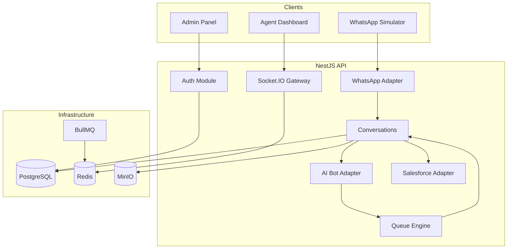

# HELIX Architecture

## System Overview

HELIX is an enterprise customer support platform built as an Nx monorepo with a NestJS API backend and Angular frontend. Customers contact support via WhatsApp; an AI bot handles FAQs and routes to human agents when needed.



## Monorepo Structure

```
Helix/
├── apps/
│   ├── api/                    # NestJS backend
│   │   ├── prisma/             # Database schema & migrations
│   │   └── src/
│   │       ├── app/
│   │       │   ├── config/     # Environment configuration
│   │       │   ├── core/       # Filters, interceptors, guards
│   │       │   ├── health/     # Health check
│   │       │   └── infrastructure/
│   │       │       └── prisma/ # Database service
│   │       └── modules/        # Feature modules
│   │           ├── auth/
│   │           ├── users/
│   │           ├── roles/
│   │           ├── departments/
│   │           ├── skills/
│   │           ├── queues/     # Priority engine + router
│   │           └── availability/
│   ├── web/                    # Angular frontend
│   └── web-e2e/                # Cypress tests
├── packages/
│   ├── types/                  # Shared TypeScript interfaces
│   ├── shared/                 # Constants, socket events
│   ├── utils/                  # Pure utility functions
│   └── ui/                     # Shared Angular components
├── docker-compose.yml
└── docs/
```

## Backend Architecture

### Layered Design

```
Controller → Service → Repository → Prisma
     ↓           ↓
   DTOs      Domain Logic
```

| Layer | Responsibility |
|-------|---------------|
| **Controller** | HTTP routing, request validation, Swagger docs |
| **Service** | Business logic, orchestration |
| **Repository** | Data access abstraction |
| **Infrastructure** | Prisma, Redis, MinIO, external adapters |

### Cross-Cutting Concerns

- **GlobalExceptionFilter** — Consistent error responses
- **TransformInterceptor** — Wraps responses in `{ success, data, timestamp }`
- **LoggingInterceptor** — Request duration logging
- **ValidationPipe** — DTO validation with class-validator
- **JwtAuthGuard** — Authentication (Phase 2)
- **PermissionsGuard** — RBAC authorization (Phase 2)

### Adapter Pattern

External integrations use adapter interfaces:

```typescript
interface WhatsAppAdapter {
  sendMessage(to: string, message: WhatsAppMessage): Promise<WhatsAppResult>;
  sendTemplate(to: string, template: TemplateMessage): Promise<WhatsAppResult>;
}

interface SalesforceAdapter {
  createCase(data: CaseData): Promise<SalesforceCase>;
  updateCase(id: string, data: Partial<CaseData>): Promise<SalesforceCase>;
}

interface AiBotAdapter {
  processMessage(conversationId: string, message: string): Promise<BotResponse>;
  generateSummary(conversationId: string): Promise<string>;
}
```

Development uses mock adapters. Production swaps in real implementations.

## Frontend Architecture

### Layout

- **Dark sidebar** navigation
- **Light workspace** content area
- **Material Design** components
- **Angular Signals** for reactive state
- **Socket.IO** for real-time updates

### Key Views

| View | Description |
|------|-------------|
| Login | JWT authentication |
| Dashboard | Executive KPIs and charts |
| Inbox | Three-pane conversation workspace |
| Simulator | WhatsApp phone mockup |
| Reports | Operational analytics |
| Admin | Users, roles, settings |

## Real-Time Architecture

Socket.IO rooms:

| Room | Members | Events |
|------|---------|--------|
| `agent:{userId}` | Individual agent | Assignments, notifications |
| `department:{deptId}` | Department agents | Queue updates |
| `conversation:{convId}` | Assigned agent + supervisors | Messages, typing |
| `dashboard` | Supervisors, admins | Stats updates |
| `simulator:{customerId}` | Simulator client | Message sync |

## Queue Engine (Phase 3)

### Modules

| Module | Endpoints | Responsibility |
|--------|-----------|----------------|
| `departments` | `/api/departments` | Department CRUD, business hours |
| `skills` | `/api/skills` | Skill CRUD, user/department assignment |
| `queues` | `/api/queues` | Queue CRUD, priority calculation, agent routing |
| `availability` | `/api/availability` | Agent status, break management |

### Priority Engine

Implemented in `@helix/utils` (`calculatePriorityScore`). Used by the queues module via `POST /api/queues/calculate-priority`.

Priority factors (weighted scoring):

| Factor | Weight |
|--------|--------|
| VIP customer | +50 |
| Complaint intent | +40 |
| Urgent travel | +35 |
| Negative sentiment (< -0.3) | +25 |
| Waiting time | +1 per minute |
| WhatsApp 24h window expiry (< 2h) | +30 |
| SLA breach | +45 |

Score thresholds → priority: LOW (&lt;10), NORMAL (10–29), HIGH (30–54), URGENT (55–79), CRITICAL (≥80).

### Queue Router

`QueueRouterService` selects agents based on queue `routingStrategy`:

| Strategy | Behavior |
|----------|----------|
| `ROUND_ROBIN` | Cycles through eligible agents |
| `LEAST_BUSY` | Agent with fewest active conversations |
| `SKILL_BASED` | Highest skill level for required skill |
| `PRIORITY` | Least-busy (used with priority-sorted queues) |
| `MANUAL` | No auto-assignment |

Eligibility filters: active user, online/busy status, department match, skill match (if required), under capacity.

### Business Hours

Per-department schedules stored in `business_hours`. Used for SLA calculations and availability checks (Phase 11).

### Agent Availability

Statuses: `ONLINE`, `OFFLINE`, `AWAY`, `ON_BREAK`, `BUSY`. Agents update via `PATCH /api/availability/me`. Supervisors view all via `GET /api/availability`.

## Database Design

- **UUID** primary keys
- **Soft deletes** (`deletedAt`)
- **Audit fields** (`createdAt`, `updatedAt`)
- **Indexes** on foreign keys, status fields, timestamps
- **JSON** columns for flexible metadata

See [Database.md](./Database.md) for full schema documentation.

## Security

- JWT access tokens (15min) + refresh tokens (7d)
- RBAC with granular permissions
- Password hashing with bcrypt
- CORS restricted to frontend origin
- Input validation on all endpoints
- Audit logging for sensitive operations

## Deployment

See [Deployment.md](./Deployment.md) for Docker-based deployment instructions.
