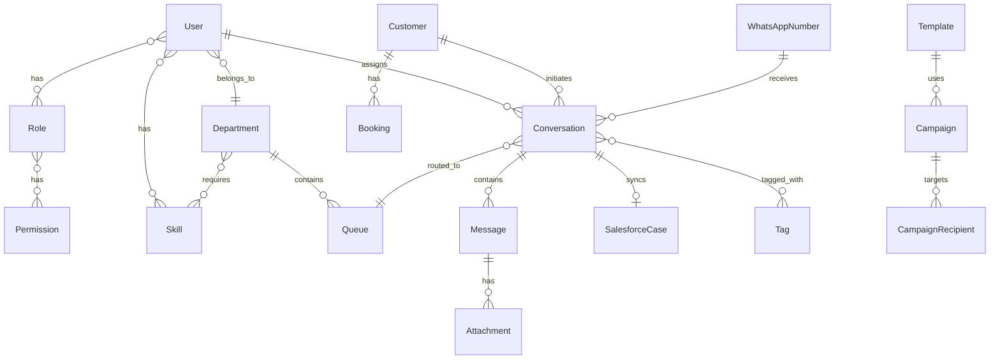

# HELIX Database Schema

Database: **PostgreSQL 16**  
ORM: **Prisma**  
Schema file: `apps/api/prisma/schema.prisma`

## Design Conventions

| Convention | Implementation |
|------------|---------------|
| Primary keys | UUID (`@default(uuid())`) |
| Timestamps | `createdAt`, `updatedAt` on all entities |
| Soft deletes | `deletedAt` on core entities |
| Naming | snake_case in DB, camelCase in Prisma |
| Indexes | Foreign keys, status fields, timestamps |

## Entity Relationship Diagram



## Core Tables

### Authentication & RBAC

| Table | Description |
|-------|-------------|
| `users` | Agent and admin accounts |
| `roles` | Role definitions (admin, supervisor, agent) |
| `permissions` | Granular permissions by module |
| `user_roles` | User ↔ Role junction |
| `role_permissions` | Role ↔ Permission junction |
| `refresh_tokens` | JWT refresh token storage |

### Organization

| Table | Description |
|-------|-------------|
| `departments` | Support departments (Flights, Hotels, etc.) |
| `skills` | Agent skills for routing |
| `user_skills` | User ↔ Skill junction with proficiency level |
| `department_skills` | Department ↔ Skill junction |
| `queues` | Routing queues with SLA config |
| `business_hours` | Per-department operating hours |
| `agent_availability` | Real-time agent status |

### Conversations

| Table | Description |
|-------|-------------|
| `customers` | WhatsApp customers |
| `conversations` | Support conversations with status lifecycle |
| `messages` | Individual messages (text, media) |
| `attachments` | File attachments (MinIO storage) |
| `tags` | Conversation tags |
| `conversation_tags` | Conversation ↔ Tag junction |
| `internal_notes` | Agent-only notes |
| `conversation_assignments` | Assignment history |

### WhatsApp & Campaigns

| Table | Description |
|-------|-------------|
| `whatsapp_numbers` | Business WhatsApp numbers |
| `templates` | Message templates |
| `campaigns` | Outbound campaigns |
| `campaign_recipients` | Per-recipient campaign status |

### Integrations

| Table | Description |
|-------|-------------|
| `bookings` | Customer booking records |
| `salesforce_cases` | Salesforce Case sync state |

### Feedback & System

| Table | Description |
|-------|-------------|
| `csat_surveys` | Customer satisfaction ratings |
| `notifications` | In-app notifications |
| `settings` | System configuration (key-value) |
| `audit_logs` | Audit trail |

## Key Enums

| Enum | Values |
|------|--------|
| `ConversationStatus` | OPEN, PENDING, WAITING, RESOLVED, CLOSED, TRANSFERRED |
| `ConversationPriority` | LOW, NORMAL, HIGH, URGENT, CRITICAL |
| `MessageSenderType` | CUSTOMER, AGENT, BOT, SYSTEM |
| `MessageStatus` | PENDING, SENT, DELIVERED, READ, FAILED |
| `AgentAvailabilityStatus` | ONLINE, OFFLINE, AWAY, ON_BREAK, BUSY |
| `QueueRoutingStrategy` | ROUND_ROBIN, LEAST_BUSY, SKILL_BASED, PRIORITY, MANUAL |

## Indexes

All foreign keys are indexed. Additional indexes on:

- `users.email`, `users.status`
- `customers.phone`, `customers.is_vip`
- `conversations.status`, `conversations.priority`, `conversations.created_at`
- `messages.conversation_id`, `messages.created_at`
- `audit_logs.entity_type + entity_id`, `audit_logs.created_at`

## Migrations

```bash
# Create migration
npm run db:migrate

# Reset database (development only)
npx prisma migrate reset --schema=apps/api/prisma/schema.prisma

# Open Prisma Studio
npm run db:studio
```

## Seed Data (Phase 4)

| Entity | Count |
|--------|-------|
| Customers | 100 |
| Agents | 20 |
| Departments | 6 |
| Conversations | 500 |
| Messages | 1000 |
